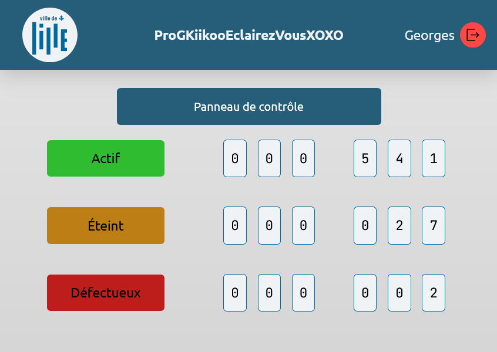

# TP ville connectée : système de gestion de l'éclairage public intelligent

**Problématique :** Concevoir un système de gestion de l'éclairage public qui s'adapte automatiquement en fonction de l'heure, de la présence de piétons ou de véhicules, et des conditions météorologiques. Le système doit permettre une réduction de la consommation énergétique tout en garantissant la sécurité des citoyens.

## Fonctionnalités

- Panneau de contrôle : Affiche le nombre de lampadaires actifs, éteints, et défectueux
- Vue de la liste des lampadaires
- Détails d'un lamadaire : localidation, date du dernier allumage, état des capteurs, alertes

## Installation :

- Cloner le repo avec `git clone --recurse-submodules lien-du-repo.git`
- Se rendre dans le dossier `tp-ville-connectee` et exécuter la commande `docker-compose up -d` dans un terminal

## Tech stack

- Frontend : React, TypeScript, Vite
- Backend : ASP.NET
- Base de données : Mongo.db

## Contributeurs

- Développement : Margot, Fares
- Conception : Antoine V., Justine, Timothé, Valentin